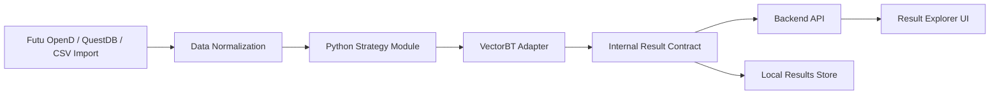

# Architecture

## Product Boundary

V1 is a single-user, Python-first, daily-bar research and backtesting product for US broad-market ETFs. It deliberately excludes live trading, multi-user operations, intraday simulation, and low-code strategy editing.

## System Shape

## Hardening Principles

- Keep external frameworks behind adapters.
- Treat result contracts as stable product APIs.
- Validate raw market data before backtests.
- Persist reproducible run metadata with parameters and schema version.
- Use deterministic fixtures for tests.
- Keep live trading out of v1 code paths.

## Initial Runtime Choices

- Python 3.11/3.12 for quantitative library compatibility.
- VectorBT as the intended backtesting engine.
- FastAPI as the backend API boundary.
- React/Vite/Recharts for the result UI.
- Local filesystem storage first, with QuestDB as an optional time-series store for larger historical datasets.

## Data Source Boundary

All data sources must normalize into the same internal daily-bar contract before strategy or backtest code can consume them. Futu OpenD, QuestDB, and CSV imports are provider implementations, not strategy dependencies.
